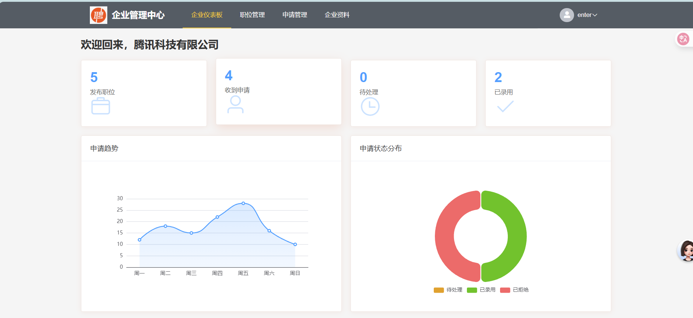
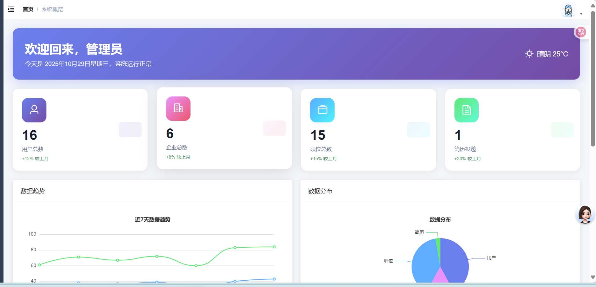
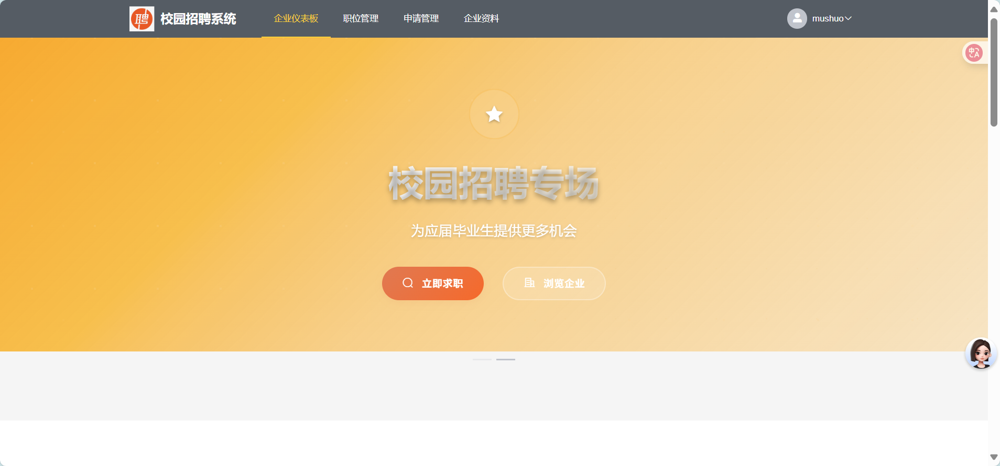

# 校园招聘系统

[](https://spring.io/projects/spring-boot)
[](https://vuejs.org/)
[](https://www.mysql.com/)
[](LICENSE)

> 基于Spring Boot + Vue.js的前后端分离校园招聘平台，为高校学生和企业提供便捷的招聘服务。

## ✨ 功能特性

- 🔐 **多角色权限管理** - 支持普通用户、企业用户、管理员三种角色
- 📄 **智能简历处理** - 支持PDF/DOC/DOCX格式，自动转换预览
- 💼 **职位管理** - 职位发布、审核、搜索筛选
- 📊 **数据统计** - 实时统计招聘数据和用户行为
- 🔔 **实时通知** - WebSocket实现消息实时推送
- 🛡️ **安全保障** - JWT认证 + Spring Security权限控制

## 界面
企业：

管理员：

用户：

## 🏗️ 技术架构

### 后端技术栈
- **Spring Boot 2.5.3** - 主框架
- **MyBatis Plus 3.5.3** - ORM框架
- **Spring Security + JWT** - 安全认证
- **MySQL 8.0** - 数据库
- **Redis** - 缓存
- **Swagger 3.0** - API文档

### 前端技术栈
- **Vue.js 2.6.14** - 前端框架
- **Element UI 2.15.6** - UI组件库
- **Axios** - HTTP客户端
- **ECharts** - 数据可视化

## 📁 项目结构

```
campus-recruitment-system/
├── campus_recruitment_-backend/     # 后端服务
├── campus_manager-frontend/         # 管理端前端
├── campus-user-frontend/           # 用户端前端
├── database/                       # 数据库脚本
├── uploads/                        # 文件上传目录
├── logs/                          # 日志文件
├── 项目说明文档.md                  # 详细项目说明
├── API接口文档.md                  # API接口文档
└── 前端接口文档.md                  # 前端开发文档
```

## 🚀 快速开始

### 环境要求
- JDK 8+
- MySQL 8.0+
- Redis
- Node.js 14+

### 1. 克隆项目
```bash
git clone https://github.com/your-username/campus-recruitment-system.git
cd campus-recruitment-system
```

### 2. 数据库配置
```sql
# 创建数据库
CREATE DATABASE campus_recruitment2;

# 导入数据库脚本
mysql -u root -p campus_recruitment2 < database/campus_recruitment.sql
```

### 3. 后端启动
```bash
cd campus_recruitment_-backend

# 修改配置文件
vim src/main/resources/application.yml

# 启动应用
mvn spring-boot:run
```

### 4. 前端启动

#### 管理端
```bash
cd campus_manager-frontend
npm install
npm run serve
```

#### 用户端
```bash
cd campus-user-frontend
npm install
npm run serve
```

## 📱 系统截图

### 用户端界面
- 首页职位展示
- 职位详情页面
- 个人中心管理

### 管理端界面
- 系统数据概览
- 用户管理界面
- 企业审核管理

### 企业端界面
- 职位发布管理
- 简历查看界面
- 申请处理页面

## 🔧 配置说明

### 后端配置 (application.yml)
```yaml
spring:
  datasource:
    url: jdbc:mysql://localhost:3306/campus_recruitment2
    username: root
    password: 123456
  redis:
    host: localhost
    port: 6379

server:
  port: 3030
```

### 前端配置 (vue.config.js)
```javascript
module.exports = {
  devServer: {
    proxy: {
      '/api': {
        target: 'http://localhost:3030',
        changeOrigin: true
      }
    }
  }
}
```

## 📚 文档

- [项目说明文档](./项目说明文档.md) - 详细的项目架构和功能说明
- [API接口文档](./API接口文档.md) - 完整的后端API接口规范
- [前端接口文档](./前端接口文档.md) - 前端开发指南和组件说明

## 🎯 核心功能

### 用户功能
- ✅ 用户注册登录
- ✅ 个人信息管理
- ✅ 简历上传管理
- ✅ 职位搜索投递
- ✅ 申请状态跟踪

### 企业功能
- ✅ 企业注册认证
- ✅ 职位发布管理
- ✅ 简历查看筛选
- ✅ 申请回复处理

### 管理功能
- ✅ 用户管理
- ✅ 企业审核
- ✅ 职位管理
- ✅ 数据统计
- ✅ 系统监控

## 🔗 在线演示

- 用户端：http://localhost:8080
- 管理端：http://localhost:8081
- API文档：http://localhost:3030/swagger-ui/

## 🤝 贡献指南

1. Fork 本仓库
2. 创建特性分支 (`git checkout -b feature/AmazingFeature`)
3. 提交更改 (`git commit -m 'Add some AmazingFeature'`)
4. 推送到分支 (`git push origin feature/AmazingFeature`)
5. 打开 Pull Request

## 📄 开源协议

本项目基于 [MIT](LICENSE) 协议开源。

## 👥 作者

- **caohao** - *项目创建者* - [GitHub](https://github.com/caohao)

## 🙏 致谢

- 感谢 Spring Boot 社区提供的优秀框架
- 感谢 Vue.js 团队的前端解决方案
- 感谢 Element UI 提供的组件库

## 📞 联系方式

如有问题或建议，请通过以下方式联系：

- 📧 Email: your-email@example.com
- 💬 QQ群: 123456789
- 📱 微信: your-wechat

---

⭐ 如果这个项目对你有帮助，请给个 Star 支持一下！